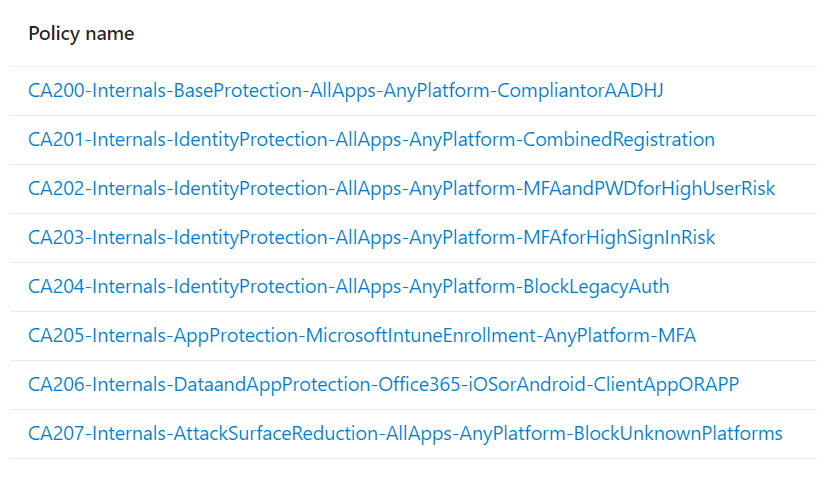

# ConditionalAccessforZeroTrust

Zero Trust Persona-based Azure AD Conditional Access Policies

Based upon the excellent [Microsoft Learn: Conditional Access architecture and personas](https://learn.microsoft.com/en-us/azure/architecture/guide/security/conditional-access-architecture) and [Framework and policies](https://learn.microsoft.com/en-us/azure/architecture/guide/security/conditional-access-framework) pages authored by [Claus Jespersen](https://www.linkedin.com/in/claus-jespersen-25b0422/).

## Prerequisite
[PowerShell SDK for Microsoft Graph](https://github.com/microsoftgraph/msgraph-sdk-powershell)
```powershell
Install-Module Microsoft.Graph -AllowClobber -Force
```
Optionally, also install:
```powershell
Install-Module Microsoft.Graph.Beta -AllowClobber -Force
```



<small>*This collection is a work in progress*.</small>

Conditional Access Policies as code deployed via the PowerShell SDK for Microsoft Graph.

## Policies

### CA200-Internals-BaseProtection-AllApps-AnyPlatform-CompliantorAADHJ
Internals require a Compliant or Domain-Joined Device.

### CA201-Internals-IdentityProtection-AllApps-AnyPlatform-CombinedRegistration
Internals performing Security registration (ie. MFA enrollment) require a Compliant or Domain-Joined Device.

### CA202-Internals-IdentityProtection-AllApps-AnyPlatform-MFAandPWDforHighUserRisk
Internals with High User Risk must perform MFA and change their password.

### CA203-Internals-IdentityProtection-AllApps-AnyPlatform-MFAforHighSignInRisk
Internals with High Sign-In Risk must perform MFA.

### CA204-Internals-IdentityProtection-AllApps-AnyPlatform-BlockLegacyAuth
Internals are blocked from Legacy Authentication methods.

### CA205-Internals-AppProtection-MicrosoftIntuneEnrollment-AnyPlatform-MFA
Internals must perform MFA to enroll a device.

### CA206-Internals-DataandAppProtection-Office365-iOSorAndroid-ClientAppORAPP
Internals accessing Office 365 from iOS or Android must use an Approved App or an App Protection Policy.

### CA207-Internals-AttackSurfaceReduction-AllApps-AnyPlatform-BlockUnknownPlatforms
Internals on unknown platforms are blocked.

